```mermaid
erDiagram
    %% Image Module
    IMAGES {
        bigint id PK
        bigint project_id FK
        varchar original_filename
        varchar file_hash UK
        bigint file_size
        varchar mime_type
        blob image_data
        blob thumbnail_data
        varchar status
        varchar tags
        text memo
        timestamp created_at
        timestamp updated_at
        timestamp deleted_at
    }

    %% Project Module
    USERS {
        bigint id PK
        varchar email UK
        varchar password
        varchar role
        varchar subscription_plan
        timestamp created_at
        timestamp updated_at
    }

    PROJECTS {
        bigint id PK
        varchar name
        varchar description
        bigint user_id FK
        varchar status
        timestamp created_at
        timestamp updated_at
        bigint version
    }

    PERMISSIONS {
        bigint id PK
        varchar resource
        varchar action
        varchar role
        varchar subscription_plan
        boolean allowed
        varchar description
        timestamp created_at
        timestamp updated_at
    }

    ROLE_POLICIES {
        bigint id PK
        varchar role
        varchar resource
        varchar action
        boolean allowed
        varchar subscription_plan
        varchar reason
        boolean is_system_policy
        timestamp created_at
        timestamp updated_at
        bigint version
    }

    AUDIT_LOGS {
        bigint id PK
        varchar action
        varchar entity_type
        bigint entity_id
        bigint admin_user_id
        varchar admin_email
        bigint target_user_id
        varchar target_user_email
        text old_value
        text new_value
        varchar reason
        varchar client_ip
        varchar user_agent
        timestamp created_at
    }

    USER_NOTIFICATIONS {
        bigint id PK
        bigint user_id FK
        varchar type
        varchar title
        varchar message
        boolean is_read
        bigint admin_user_id
        varchar reference_id
        timestamp created_at
        timestamp read_at
    }

    %% 관계 ì •ì˜
    USERS ||--o{ PROJECTS : owns
    PROJECTS ||--o{ IMAGES : contains
    USERS ||--o{ USER_NOTIFICATIONS : receives
```

# Bound4 Project

마이크로서비스 아키텍처 기반의 Spring Boot 애플리케이션으로, 이미지 관리와 프로젝트 관리를 제공합니다.

## 📁 프로젝트 구조

```
bound4/
├── image-module/          # 고성능 이미지 관리 모듈
├── project-module/        # RBAC 기반 프로젝트 관리 모듈
├── build.gradle          # 루트 빌드 설정
└── settings.gradle       # 모듈 설정
```

## 🚀 주요 기능

### Image Module
- **이미지 업로드/관리**: 멀티파일 업로드 및 중복 파일 감지 (해시 기반)
- **커서 기반 페이지네이션**: 대용량 데이터 처리를 위한 고성능 페이징
- **비동기 썸네일 생성**: 이벤트 드리븐 아키텍처 기반 썸네일 처리
- **AWS S3 연동**: 클라우드 스토리지 지원 (Mock 구현 포함)
- **성능 모니터링**: 페이징 성능 측정 및 분석 기능

### Project Module
- **RBAC 시스템**: 역할 기반 접근 제어 (Role A,B,C,D)
- **JWT 인증**: 토큰 기반 인증 및 권한 관리
- **구독 플랜**: BASIC/PRO 플랜별 권한 차등 적용
- **감사 로그**: 모든 관리자 행동 추적 및 로깅
- **실시간 알림**: 권한 변경 시 사용자 알림 시스템
- **정책 백업/복구**: 권한 정책의 백업 및 복구 기능

## 📊 데이터베이스 ERD



## 🛠 기술 스택

### 공통
- **Java**: 21 (Eclipse Temurin)
- **Spring Boot**: 3.5.6
- **Build Tool**: Gradle 8.x
- **Database**: H2 (개발환경)
- **Documentation**: Spring REST Docs + AsciiDoc

### Image Module
- **Spring Data JPA**: 데이터 영속성
- **QueryDSL**: 복잡한 쿼리 처리
- **Spring Events**: 비동기 이벤트 처리
- **AWS S3**: 파일 저장소 (Mock 포함)

### Project Module
- **Spring Security**: 인증 및 권한 관리
- **JWT**: JSON Web Token 인증
- **Method Security**: 메서드 레벨 보안
- **Spring Cache**: 성능 최적화

## 📦 패키지 구조 (Hexagonal Architecture)

### Image Module
```
com.bound4.image/
├── adapter/
│   ├── in/web/          # REST 컨트롤러 및 DTO
│   └── out/             # 외부 시스템 어댑터
│       ├── persistence/ # JPA 엔티티 및 리포지토리
│       ├── storage/     # S3 스토리지 서비스
│       ├── hash/        # 해시 서비스
│       ├── thumbnail/   # 썸네일 생성 서비스
│       └── event/       # 이벤트 퍼블리셔
├── application/
│   ├── port/            # 유스케이스 인터페이스
│   └── service/         # 비즈니스 로직
├── domain/              # 도메인 엔티티 및 VO
└── config/              # 설정 클래스
```

### Project Module
```
com.bound4.project/
├── adapter/
│   ├── in/web/          # REST 컨트롤러 및 DTO
│   └── out/persistence/ # JPA 리포지토리
├── application/
│   └── service/         # 비즈니스 서비스
├── domain/              # 도메인 엔티티
└── config/
    └── security/        # 보안 설정
```

## 🔧 실행 방법

### 로컬 개발 환경

1. **프로젝트 클론**
```bash
git clone https://github.com/sm9171/bound4.git
cd bound4
```

2. **빌드**
```bash
./gradlew build
```

3. **각 모듈 실행**
```bash
# Image Module 실행
./gradlew :image-module:bootRun

# Project Module 실행  
./gradlew :project-module:bootRun
```

### Docker 실행

1. **이미지 빌드**
```bash
# Image Module
cd image-module
docker build -t bound4/image-module:latest .

# Project Module  
cd project-module
docker build -t bound4/project-module:latest .
```

2. **컨테이너 실행**
```bash
# Image Module 실행
docker run -p 8080:8080 bound4/image-module:latest

# Project Module 실행
docker run -p 8081:8080 bound4/project-module:latest
```

### DockerHub에서 다운로드

```bash
# 이미지 다운로드
docker pull sm9171/image-module:latest
docker pull sm9171/project-module:latest

# 컨테이너 실행
docker run -p 8080:8080 sm9171/image-module:latest
docker run -p 8081:8080 sm9171/project-module:latest
```

## 📚 API 문서

각 모듈의 REST API 문서는 Spring REST Docs를 통해 제공됩니다.

- **Image Module API**: http://localhost:8080/docs/index.html
- **Project Module API**: http://localhost:8081/docs/index.html

## 🧪 테스트

```bash
# 전체 테스트 실행
./gradlew test

# 특정 모듈 테스트
./gradlew :image-module:test
./gradlew :project-module:test

# 테스트 결과 확인
open build/reports/tests/test/index.html
```

## 🔐 보안 고려사항

### RBAC 시스템
- **역할 기반 접근 제어**: 4단계 역할 (A,B,C,D)
- **구독 플랜별 권한**: BASIC/PRO 플랜별 차등 권한
- **동적 권한 관리**: 실시간 권한 정책 업데이트
- **감사 추적**: 모든 권한 변경 사항 로깅

### 인증 및 인가
- **JWT 토큰**: 상태 없는 인증 방식
- **Method Security**: 메서드 레벨 보안 적용
- **커스텀 보안 표현식**: 세밀한 권한 제어

## 🚀 성능 특징

### Image Module
- **커서 페이지네이션**: OFFSET 기반 대비 90% 이상 성능 향상
- **비동기 썸네일 생성**: 이벤트 기반 논블로킹 처리
- **해시 기반 중복 제거**: SHA-256을 통한 효율적인 파일 관리

### Project Module
- **캐시 최적화**: 자주 조회되는 권한 정보 캐싱
- **배치 처리**: 대량 권한 업데이트 최적화
- **인덱스 최적화**: 쿼리 성능을 위한 전략적 인덱싱

## 📋 버전 정보

- **Version**: 0.0.1-SNAPSHOT
- **Java**: 21
- **Spring Boot**: 3.5.6
- **Build**: Gradle 8.x

## 🤝 기여

프로젝트에 기여를 원하시면 다음 단계를 따라주세요:

1. Fork the Project
2. Create your Feature Branch (`git checkout -b feature/AmazingFeature`)
3. Commit your Changes (`git commit -m 'Add some AmazingFeature'`)
4. Push to the Branch (`git push origin feature/AmazingFeature`)
5. Open a Pull Request

## 📄 라이센스

이 프로젝트는 MIT 라이센스 하에 배포됩니다. 자세한 내용은 `LICENSE` 파일을 참조하세요.